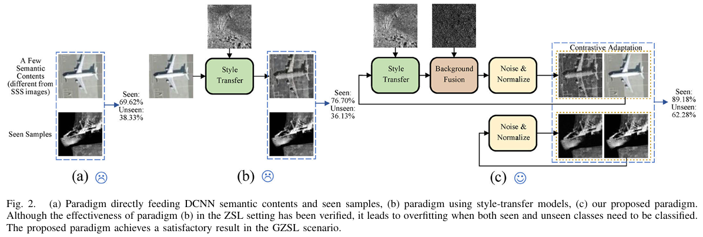

# CADA-SSS Generalized Zero Shot Side Scan Sonar Image Classification [IEEE-T-IM 2025]

## Highlights

> **<p align="justify"> Abstract:** *Predicting never-seen-before targets in underwater side-scan sonar (SSS) recognition is challenging due to limited data availability and complex environmental factors.
> Traditional supervised methods achieve high accuracies in standard tasks but fail to generalize in zero-shot scenarios. Recent style-based transfer learning methods for zero-shot learning (ZSL) in SSS
> have shown promise but suffer from unrealistic environmental and sample assumptions. To overcome these limitations, we propose Contrastive Adaptation of Domain Augmentation (CADA), a novel learning
> paradigm that utilizes background fusion and noise modeling to expand generalized zero-shot learning (GZSL), offering greater practicality in engineering. By integrating simulated SSS noise with fused backgrounds,
> our approach augments unseen classes, improves class separability, and mitigates overfitting. The contrastive adaptation further narrows domain distribution gaps while preserving critical intra-class semantic
> content information. Moreover, we introduce the first SSS image dataset tailored for the GZSL application. Experimental results show that CADA reached up to 73.32% on the harmonic mean index,
> achieving over 20% higher accuracy than existing state-of-the-art style-based methods, highlighting its effectiveness for SSS target classification in GZSL settings.

## Main Contributions

1) A novel CADA learning paradigm for SSS image classification is proposed.
2) A background fusion with added SSS image noise is introduced.
3) An available SSS dataset for GZSL research is provided.


Official implementation of the paper "[Contrastive Adaptation on Domain Augmentation for Generalized Zero-Shot Side-Scan Sonar Image Classification](https://ieeexplore.ieee.org/abstract/document/10925503)".

### How to install datasets
- Download the dataset from the [official website](https://drive.google.com/file/d/1OJ-co80Htd3kuVmmccFZMUKyzQ0m5hsu/view?usp=sharing) or [official website2](https://pan.baidu.com/s/1cR37T3xdU-i47gajs3rtGg) (提取码: w55w), and extract the training and testing sets. The directory structure should look like
```
datasets/
|–– gzsss_data/
|   |–– train/
|   |–– val/
|   |-- classnames.txt
```

### Requirements
This code is tested under Ubuntu 18.04 or Windows11+anaconda23.1.0. The total project can well function under the following environment:
* python-3.9
* pytorch-1.13
* torchvision-0.14
* tensorboardX >= 2.6
* other packages under python-3.9

### Acknowledgments
The code is based on project [PhotoWCT](https://github.com/svjack/PhotoWCT), [LiWCT](https://github.com/guizilaile23/ZSL-SSS), [StyTr](https://github.com/diyiiyiii/StyTR-2) and [CCPL](https://github.com/JarrentWu1031/CCPL). [GCEA](https://github.com/baizhongyu/GCEANet) We sincerely thank them for their great work.
